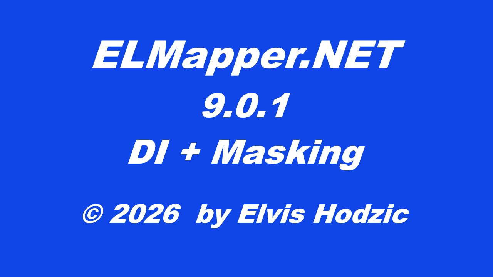

# 📘 ELMapper.NET

<p align="center">
  
</p>

**Lightweight .NET object mapper for object-to-object and collection mapping.**

**Lightweight .NET object mapper for object-to-object and collection mapping.**

ELMapper.NET provides predictable and explicit mapping between source and destination models with configurable mapping behavior.

Version **9.0.0** introduces Dependency Injection support and built-in sensitive data masking while preserving compatibility with previous extension method-based usage.

---

## 🚀 Overview

ELMapper.NET is designed to simplify object mapping with clear and controlled mapping rules.

The library supports:

- **Object-to-object mapping**
- **Collection-to-collection mapping**
- Configurable mapping behavior
- Mapping into existing destination objects
- **Sensitive data masking**

The main goal is to provide simple and predictable mapping without hidden behavior.

---

## ✨ Features

### 🔄 Mapping

✔ Object-to-object mapping  
✔ Collection-to-collection mapping  
✔ Mapping into existing destination objects  
✔ Case-insensitive property matching  

### ⚙️ Configuration

✔ Configurable mapping behavior  
✔ Runtime property exclusion using `Ignore`  
✔ Fail-fast validation  

### 🔒 Security

✔ Sensitive data masking during mapping  

### 🔌 Integration

✔ .NET Dependency Injection support (introduced in 9.0.0)  
✔ Backward compatible extension method usage

---

## ✨ What's New in 9.0.0

### 🚀 Dependency Injection Support

ELMapper.NET can now be registered using the standard .NET Dependency Injection container.

Use the provided `IServiceCollection` extension method:

```csharp
services.AddELMapper();
```
Example using an application service registration pattern:
```csharp
public static class ApplicationServiceRegistration
{
    public static IServiceCollection AddApplication(
        this IServiceCollection services)
    {
        services.AddELMapper();

        return services;
    }
}
```

### 🔒 Sensitive Data Masking

Version **9.0.0** introduces built-in **sensitive data masking** capabilities during the mapping process.

Masking rules are configured through `MappingOptions`.

Supported masking methods:

```csharp
Mask.KeepFirst(int count)

Mask.KeepLast(int count)

Mask.KeepFirstLast(int first, int last)

Mask.MaskAll()
```


## 📦 Installation

Install ELMapper.NET using NuGet:

```bash
dotnet add package ELMapper.NET
```

---

## 🚀 Usage

### Object Mapping

ELMapper.NET maps source models into destination models using explicit mapping rules.

Example:

```csharp
var primaryAccount = await _eLMapperNET
    .MapObjectAsync<AccountCardSummaryQueryModel, PrimaryAccountDto>(
        primaryAccountData!);
```

### Mapping to Existing Destination Object

ELMapper.NET supports mapping into an existing destination object.

By passing the destination instance as the second parameter, existing destination values are preserved for properties that are not available in the source object.

Example:

```csharp
// Existing destination object retrieved from external source
var destination = await employeeRepository.GetEmployeeDtoAsync(id);

// Existing value from destination object
// Address: "125 Main Street, New York, USA"

return await _eLMapperNET.MapObjectAsync<BankEmployee, EmployeesDto>(
    sourceData,
    destination);
```

### Collection Mapping

ELMapper.NET supports mapping collections of source models into destination collections.

Example:

```csharp
var paymentOrders = await _eLMapperNET
    .MapIEnumerableAsync<PaymentOrderSummaryQueryModel, ResponsePaymentOrdersOverview>(
        paymentOrdersData);
```

### Mapping Collection into Existing Destination Collection

ELMapper.NET supports mapping into an existing destination collection.

By passing the destination collection as the second parameter, existing destination values are preserved for properties that are not available in the source objects.

```csharp
// Existing destination collection retrieved from external source
var destination = await employeeRepository.GetEmployeeDtosAsync();

// Existing values from destination objects are preserved
// Example:
// Address: "125 Main Street, New York, USA"

var sourceData = await context.BankEmployees
    .Where(x => x.IsActive)
    .ToListAsync();

return await _eLMapperNET
    .MapIEnumerableAsync<BankEmployee, EmployeesDto>(
        sourceData,
        destination);
```

### Mapping Options

Mapping behavior can be customized through `MappingOptions`.

The `Ignore` option allows excluding specific properties from the mapping process. Ignored property values are not copied from the source object to the destination object.

Example:

```csharp
return await _eLMapperNET.MapObjectAsync<BankEmployee, EmployeesDto>(
    sourceData,
    mappingOptions: new MappingOptions
    {
        Ignore = new List<string>
        {
            nameof(EmployeesDto.FirstName),
            nameof(EmployeesDto.LastName)
        }
    });
```

### 🔒 Sensitive Data Masking

Sensitive properties can be protected by applying `Masking` rules during object and collection mapping.

#### Object Mapping Examples

Example: protecting IBAN information during account mapping.

```csharp
var primaryAccount = await _eLMapperNET
    .MapObjectAsync<AccountCardSummaryQueryModel, PrimaryAccountDto>(
        primaryAccountData!,
        mappingOptions: new MappingOptions
        {
            Masking = new Dictionary<string, string>
            {
                {
                    nameof(PrimaryAccountDto.IBAN),
                    Mask.KeepFirstLast(4, 4)
                }
            }
        });
```
- Masked output example

```text
IBAN
BA39************1234
```
Example: protecting CardNumber information during account mapping.
```csharp
var debitCard = await _eLMapperNET
    .MapObjectAsync<AccountCardSummaryQueryModel, InternalPrimaryDebitCardDto>(
        debit_card!,
        mappingOptions: new MappingOptions
        {
            Masking = new Dictionary<string, string>
            {
                {
                    nameof(InternalPrimaryDebitCardDto.CardNumber),
                    Mask.KeepFirst(5)
                }
            }
        });
```
- Masked output example

```text
Card Number
53998***********
```

#### Collection Mapping Example

Example: protecting payment order IBAN information.

```csharp
return await _eLMapperNET
    .MapIEnumerableAsync<PaymentOrderSummaryQueryModel, ResponsePaymentOrdersOverview>(
        paymentOrders,
        mappingOptions: new MappingOptions
        {
            Masking = new Dictionary<string, string>
            {
                {
                    nameof(ResponsePaymentOrdersOverview.DebtorIBAN),
                    Mask.KeepFirstLast(4, 4)
                },
                {
                    nameof(ResponsePaymentOrdersOverview.CreditorIBAN),
                    Mask.KeepFirstLast(4, 4)
                }
            }
        });
```

* Masked output example

```json
[
  {
    "DebtorIBAN": "BA39************4821",
    "CreditorIBAN": "DE89************9165"
  },
  {
    "DebtorIBAN": "FR14************1378",
    "CreditorIBAN": "BA39************6542"
  },
  {
    "DebtorIBAN": "BA39************8204",
    "CreditorIBAN": "IT60************4419"
  }
]
```

---

## 🔄 Mapping Behavior

### Property Matching

- Properties are matched by name.
- Matching is case-insensitive.
- Only matching properties are mapped.

### Ignore Validation

- Ignored properties must exist in the source type.
- Invalid configuration throws an exception.
- Validation follows fail-fast principles.

### Execution Model

- Mapping works with in-memory objects.
- Mapping is performed using reflection.
- IQueryable projection is not supported.

---

## 🔁 Backward Compatibility

**ELMapper.NET 9.x maintains compatibility with previous extension method-based usage.**

 Supported previous versions:

- ELMapper.NET 8.0.2
- ELMapper.NET 8.1.1

Existing extension method-based usage remains supported.

Example:

```csharp
var result = source
    .MapObject<Source, Destination>();
```
---

## 🧠 Design Philosophy

ELMapper.NET is built around:

- Simple usage
- Predictable behavior
- Explicit configuration
- Developer control
- No silent mapping rules

---

## 📄 License

This project is licensed under the MIT License.

Copyright © 2026 Elvis Hodzic.

---

## 🔗 Repository

Source code, issues, and documentation are available on GitHub.

https://github.com/elvish91/ELMapper.NET